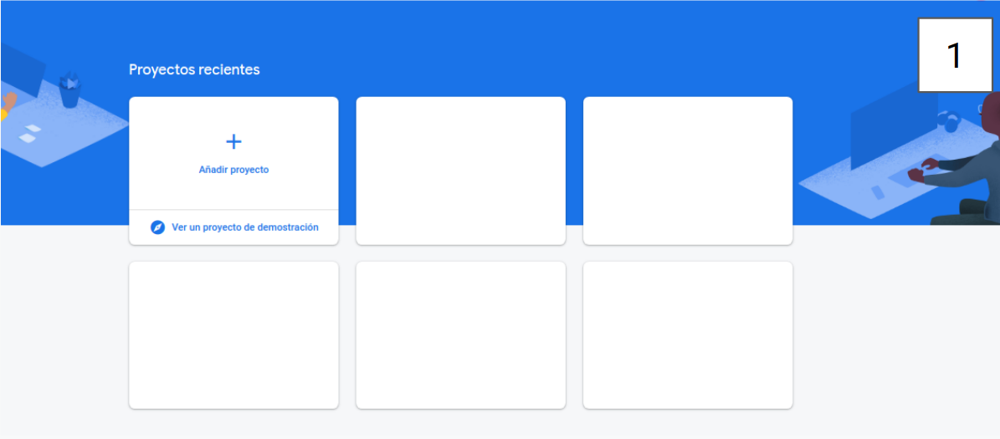
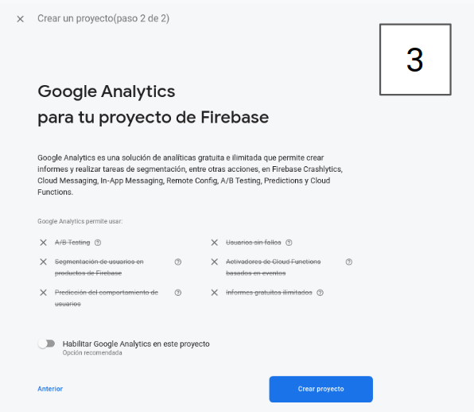
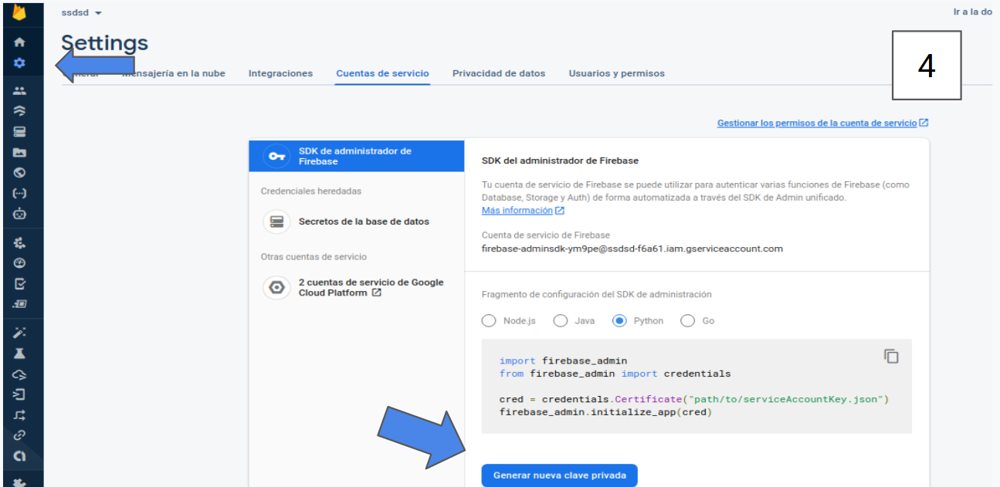
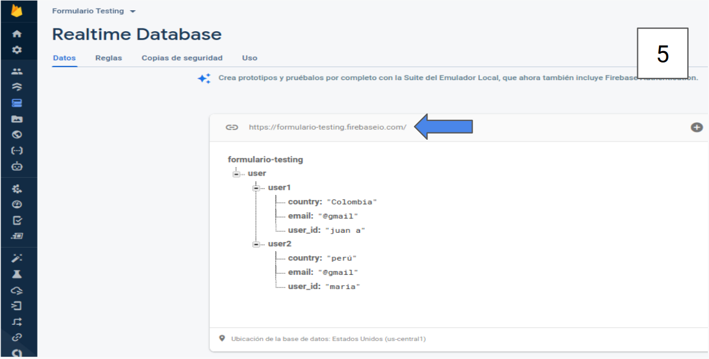

# Firebase_realtime_to_python_basic

Este es un scrip basico para poder conectarnos a firebase Realtime de manera muy rapida con python.


# Tecnologias

* [firebase](https://firebase.google.com/products/realtime-database?gclid=COGg3bX2lu0CFYFWHwodYLYCoQ)
* [python 3.8](https://www.python.org/downloads/)
* [python firebase-sdk](https://firebase.google.com/docs/admin/setup?hl=es#python)


# Creamos el proyecto de Firebase 

* [firebase](https://console.firebase.google.com/?hl=es)
<br>
  
<br>

# Creamos el proyecto de Firebase 


<br>
  
<br>

# Por el momento desactivamos las opciones de analitycs


<br>
  
<br>

# Generamos y descargamos las credenciales de proyecto 
  

<br>
  
<br>

# Copiasmos nuestro url


<br>
  
<br>

# Clonamos el repositorio en nuestra carpeta e inicializamos un entorno virtual
  
  *Copiamos el json que contiene nuestras credenciaes en la ruta /path/to con el nombre de serviceAcconuntKey.json
   cambiamos el url por el que copiamos en el paso anterior
  *Instalamos los requerimiento necesario y ejecutamos el scrip
  ```
  git clone https://github.com/MauricioAli/Firebase_realtime_to_python_basic.git
  virtualenv venv
  source venv/bin/activate
  pip install -r requirements.txt
  python app.py
  ```

